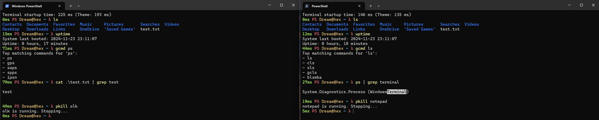

# PowerShell Profile

## Table of Content

1. [Preview](#preview)
2. [Overview](#overview)
3. [Features](#features)
4. [Installation Guide](#installation-guide)
   - [What the Scripts Do](#what-the-scripts-do)
   - [PowerShell Profile Location](#powershell-profile-location)
   - [How to Use the Scripts](#how-to-use-the-scripts)
     - [`.bat` Files (Windows Batch Scripts)](#bat-files-windows-batch-scripts)
     - [`.ps1` Files (PowerShell Scripts)](#ps1-files-powershell-scripts)
   - [Finalizing the Installation](#finalizing-the-installation)
5. [Usage](#usage)
   - [Aliases](#aliases)
   - [Functions](#functions)
6. [Uninstallation](#uninstallation)

## Preview



A demonstration of the customized PowerShell, pwsh terminal in action, featuring aliases and themed appearance.

## Overview

This repository provides my `PowerShell` and `pwsh` profile designed to enhance your terminal experience. The included scripts make it quick and easy to set up the profile along with necessary dependencies and themes.

A collection of PowerShell functions and aliases for enhanced productivity.

## Features

- Custom aliases (`vi`, `cd`, `touch`, etc.)
- Fuzzy directory navigation with `fzf`
- Text search (`grep`)
- System management (shutdown, reboot, process kill)
- IP address discovery (IPv4/IPv6)
- Package management (`winget`)
- Command history and search
- System uptime display

---

## Installation Guide

### What the Scripts Do

The provided installation and uninstallation scripts perform the following tasks:

1. **Install Dependencies**: Ensures essential tools (`fzf`, `zoxide`, `eza`, etc.) are installed using the Windows Package Manager (`winget`).
2. **Set Up Themes**: Clones the [terminal-themes](https://github.com/DreamTimeZ/terminal-themes) repository into your `Documents` folder under `TerminalThemes` for an enhanced terminal aesthetic.
3. **Configure Profile**: Copies the PowerShell profile script to the appropriate location defined by `$PROFILE.CurrentUserCurrentHost`. This ensures the profile is automatically loaded for new terminal sessions.

---

### PowerShell Profile Location

The installation scripts automatically detect and configure the correct profile path:

- **Location**: The profile is saved to the path specified by `$PROFILE.CurrentUserCurrentHost`.
- **Terminal Compatibility**: Supports both Windows PowerShell and PowerShell Core (`pwsh`). Run `install.ps1` in the pwsh to install it for the pwsh terminal. The scripts handle compatibility automatically.
- **Manual Check**: To verify or inspect all profile locations, run:
  - You set another profile file location on the top of the `install.ps1`.

  ```powershell
  $PROFILE | Select-Object *
  ```

---

### How to Use the Scripts

#### `.bat` Files (Windows Batch Scripts)

- **Installation**: Double-click `install.bat` to install the profile and dependencies.
- **Uninstallation**: Double-click `uninstall.bat` to remove the profile and its associated setup.
- **Note**: `.bat` scripts start a Windows PowerShell subprocess and cannot directly run in the `pwsh` terminal. To use it in the `pwsh` terminal, edit the `.bat` file and replace `powershell` with `pwsh`.

#### `.ps1` Files (PowerShell Scripts)

- **Installation**:
  - Run the script in `PowerShell` or `pwsh`:

    ```powershell
    .\install.ps1
    ```

- **Uninstallation**:
  - Run the uninstallation script:

    ```powershell
    .\uninstall.ps1
    ```

- **Alternative**:
  - Right-click the `.ps1` file and select "Run with PowerShell."

---

### Finalizing the Installation

After running the installation script, apply the changes by:

1. **Manually Activating the Profile**:

   ```powershell
   & $PROFILE
   ```

2. **Restarting Your Terminal**: The profile will load automatically in future sessions.

## Usage

### Aliases

- `vi`: Open Neovim
- `touch`: Create a new file
- `cd`: Use `zoxide`
- `ls`: File listing (`eza`)

### Functions

- `cdf`: Change directory using `fzf`
- `grep`: Search text (pipeline/input)
- `pkill`: Kill a process by name
- `poweroff`: Shutdown system
- `reboot`: Reboot system
- `IPv4`/`IPv6`: Get local/public IPs or domain IP
- `update`: Update packages via `winget`
- `uptime`: Show system uptime
- `hist`: Display command history
- `gcmd`: Search commands
- `n`: Open files in Notepad

## Uninstallation

Follow the same process as installation, using the corresponding `uninstall.bat` or `uninstall.ps1` scripts.

---

Feel free to raise issues or contribute to this project!
